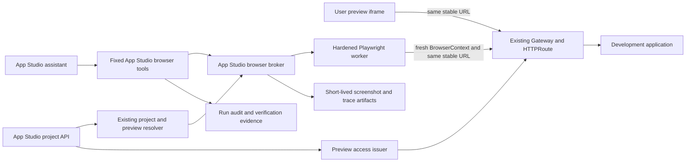

# App Studio agent browser

Status: proposal
Date: 2026-07-30

## Summary

App Studio should add a first-class, preview-scoped browser capability for its
coding agent. The browser should open the same stable development URL as the
existing preview pane, observe the same hot-reloaded application, and expose a
small fixed set of App Studio tools for navigation, interaction, accessibility
state, screenshots, console failures, and network failures.

The recommended implementation is:

1. Use Playwright and Chromium as the browser engine.
2. Run them in a separately hardened, internal browser worker.
3. Create one disposable browser process, worker pod, and non-persistent
   `BrowserContext` per AssistantRun.
4. Resolve the preview URL server-side through App Studio's existing project and
   template path. Never accept an arbitrary model-supplied URL.
5. Register browser operations as fixed App Studio tools beside the existing
   workspace and runtime tools. Do not expose a general MCP or plugin surface.
6. Use `@playwright/mcp` behind a private adapter for an initial spike if it
   accelerates delivery, but keep the App Studio tool schemas and security
   boundary independent of it.

This is not a recommendation to build browser automation from raw Chrome
DevTools Protocol (CDP). Playwright already supplies the hard browser mechanics:
context isolation, actionability and auto-waiting, accessibility snapshots,
screenshots, viewport control, and console/network events. The custom work is
the product and security layer Playwright intentionally does not provide:
tenant scope, preview-only navigation, agent authentication, lifecycle, egress
control, redaction, quotas, artifacts, and audit.

There is one prerequisite. The current template preview path no longer has the
old signed preview gateway. `authorize-development-preview` authenticates the
caller before returning the URL, but the common development templates expose the
resulting URL publicly by default. App Studio must align the edge behavior with
`Project.spec.sharing.preview` before describing either the user or agent preview
as private.

## Goals

- Let the coding agent open the current Project's development preview.
- Reuse the existing template instance, `status.url`, HTTPRoute, public edge,
  hot reload, workspace isolation, and preview-readiness path.
- Keep the agent browser isolated from the user's preview iframe and regular
  browser state by default.
- Support:
  - open and navigate within the preview
  - click, type, press keys, and scroll
  - refresh and viewport changes
  - accessibility/structured page snapshots
  - screenshots
  - JavaScript console errors and uncaught page errors
  - failed requests and HTTP 4xx/5xx responses
  - post-change verification tied to a workspace mutation revision
- Preserve App Studio's existing tool, approval, WorkItem, audit, and assistant
  phase boundaries.
- Let the user annotate DOM elements in the development preview without sharing
  the user's browser session with the agent; preserve document-generation
  staleness rather than pretending a later DOM is the same target.

## Current system

### Preview routing and URL lifecycle

The current request path is:

1. The portal calls authenticated
   `POST /api/projects/{project}/authorize-development-preview`.
2. App Studio resolves the caller's logical cluster and Project, then resolves
   the development template instance.
3. The instance's `status.url` is treated as the candidate preview URL.
4. App Studio probes the public edge before declaring the preview ready.
5. The portal mounts that URL in its iframe only after the authorization call
   returns `ready: true`.

Relevant code:

- App Studio's backend runs behind the hub provider proxy, acting as the caller
  rather than a provider service account:
  `providers/app-studio/api/server.go:17-22`.
- The preview endpoint is registered at
  `providers/app-studio/api/server.go:143-180` and implemented in
  `providers/app-studio/api/development_sync.go:187-209`.
- Template preview resolution returns the instance's public `status.url` in
  `providers/app-studio/api/project_template.go:339-380`.
- The edge readiness probe and its success cache are in
  `providers/app-studio/api/preview_edge.go:21-135`.
- The portal authorization, retry, and iframe refresh flow is in
  `providers/app-studio/portal/src/App.vue:2090-2277`.
- The preview iframe is rendered in
  `providers/app-studio/portal/src/App.vue:4048-4057`.

The URL is stable because the development instance name is deterministic and
the infrastructure provider derives a tenant-specific hostname. Development and
production modes use the same template route graph; development mode replaces
the workload image and command while preserving the Service and HTTPRoute. See
`providers/infrastructure/install/templates/simple-webapp.yaml:125-180` and
`:237-269`.

### Hot reload and workspace isolation

Project files remain App Studio-owned. Sync partitions them by each template
component's `workspacePath` and invokes infrastructure data-plane subresources
as the caller:

- `providers/app-studio/api/development_sync.go:212-305`
- `providers/app-studio/api/dataplane_client.go:23-154`

The infrastructure provider authorizes the tenant user against the published
instance, then privately reaches the runtime. App Studio holds no runtime-cluster
kubeconfig. The dev overlay injects the workspace and development agent that
supervises the template's declared start command and reload behavior.

The browser does not need another sync, proxy, or URL mechanism. It should keep a
page open on the existing URL and observe HMR/WebSocket updates just like any
other browser. Explicit refresh remains available for frameworks or failures
that do not recover cleanly through HMR.

### Existing assistant seams

App Studio already has the correct product boundary:

- Eino is behind the App Studio-owned private engine contract in
  `providers/app-studio/api/assistant_contract.go:30-79`.
- Fixed local tools are registered in
  `providers/app-studio/api/assistant_tool_registry.go:128-134`.
- Tool metadata has explicit risk and bundle classification in
  `providers/app-studio/api/assistant_tool.go:29-114`.
- Every invocation passes through the App Studio permission and audit path in
  `providers/app-studio/api/assistant_eino_tool.go:271-456`.
- Turn profiles and lifecycle phases explicitly filter visible tools in
  `providers/app-studio/api/assistant_turn_profile.go:386-431` and
  `providers/app-studio/api/assistant_eino_phase.go`.

Browser tools should use those fixed seams. They should not enter dynamic MCP
discovery or `tool_search`.

### Current access-control mismatch

The API shape still contains preview-token expiry fields, but current
template-backed previews return the direct template URL and do not mint a signed
preview token. The old signed preview gateway was deliberately removed when
templates became the only development path.

At the same time:

- `Project.spec.sharing.preview` says private preview access is currently
  enforced in `providers/app-studio/apis/ai/v1alpha1/types_project.go:86-123`.
- `simple-webapp` exposes its HTTPRoute without an auth gate.
- `application` defaults `oidc.mode` to `none`, which is explicitly public.

Therefore, authorization to learn the URL is not authorization at the URL. This
is already a product/security mismatch, independent of the agent browser. The
agent browser makes it impossible to ignore because it needs a separate,
audience-bound identity at the same origin.

## Industry options

| Option | Strengths | Gaps for App Studio | Decision |
|---|---|---|---|
| Direct Playwright library | Mature browser contexts, locators, auto-wait, ARIA snapshots, screenshots, console/network events, routing, viewport control | App Studio must build session, tenancy, auth, egress, tools, artifacts, and audit | Recommended production foundation |
| Microsoft Playwright MCP | Ready LLM-oriented ref model and tool schemas; isolated mode; console/network tools; programmatic use; annotation precedent | Explicitly not a security boundary; broad catalog; arbitrary code/evaluation and storage/file capabilities must not be exposed; origin filters do not cover redirects | Good internal spike or adapter, not the product boundary |
| `different-ai/opencode-browser` | Small direct-CDP implementation; simple accessibility UID flow | Current `main` accepts a raw `browser_url`, exposes evaluation, does not create isolated contexts, and lacks the required console/network/auth/session lifecycle | Useful reference only |
| Chrome DevTools MCP | Deep Chrome diagnostics, performance, tracing, network and source-mapped console tooling | Much broader than preview verification; Chrome-only; larger security and product surface | Later benchmark for advanced diagnostics |
| Vercel `agent-browser` | Sessions, accessibility refs, console/network support, and useful containment patterns across subresources, workers, WebSockets, beacon traffic, and WebRTC | Adds another general browser daemon/CLI contract where Playwright already fits the embedded service | Security-pattern reference and comparison spike only |

Primary upstream references:

- [Playwright MCP](https://github.com/microsoft/playwright-mcp)
- [Playwright MCP snapshots](https://playwright.dev/mcp/snapshots)
- [Playwright MCP capabilities](https://playwright.dev/mcp/capabilities)
- [Playwright BrowserContext](https://playwright.dev/docs/api/class-browsercontext)
- [Playwright authentication guidance](https://playwright.dev/docs/auth)
- [Current opencode-browser](https://github.com/different-ai/opencode-browser)
- [Chrome DevTools MCP](https://github.com/ChromeDevTools/chrome-devtools-mcp)
- [Vercel agent-browser](https://github.com/vercel-labs/agent-browser)

The Codex product analogy is directionally useful: its built-in browser uses a
separate profile, can click/type/inspect/screenshot, supports page annotations,
and treats full CDP access as a separate sensitive capability. App Studio should
copy the separation and product affordances, not assume it can reuse Codex's
implementation. See [Codex Browser](https://learn.chatgpt.com/docs/browser).

## Recommended architecture



### 1. App Studio browser broker

Add an App Studio-owned `projectBrowserPort`/`projectBrowserManager` dependency.
It is responsible for:

- resolving the current preview through
  `authorizeProjectDevelopmentPreviewTarget`
- proving that the URL came from the current Project's current template instance
- deriving the exact permitted origin
- minting a short-lived worker session capability
- creating, leasing, and closing browser sessions
- mapping App Studio tools onto the worker's narrow RPC
- redacting and bounding worker results
- associating artifacts and evidence with the Project UID, actor, WorkItem, run,
  and workspace mutation revision

The model should never choose a `browser_url`, CDP endpoint, tenant, Project UID,
or browser-session credential.

Use immutable scope:

```text
org UUID
workspace UUID / logical cluster ID
Project UID
actor identity hash
WorkItem ID
AssistantRun ID
random browser session ID
```

Project name or preview hostname alone is not sufficient.

### 2. Hardened browser worker

Run Playwright and Chromium outside the distroless App Studio provider image.
Use a small internal scheduler/controller Deployment to lease a disposable
Job/Pod per AssistantRun. This keeps browser crashes and resource spikes out of
the assistant API without multiplexing hostile pages in one worker.

The worker:

- runs one Chromium process and one non-persistent `BrowserContext` for one
  AssistantRun
- starts with empty cookies, local storage, session storage, cache, history, and
  navigation state
- destroys the browser process and worker pod on assistant stop, terminal run
  state, explicit close, idle timeout, hard TTL, crash, or quota violation
- recreates a fresh context after provider/worker restart rather than restoring
  browser state
- exposes no tenant-visible CDP, WebSocket, or MCP endpoint
- accepts only authenticated, audience-bound calls from App Studio

BrowserContext isolation prevents normal storage sharing, but it is not a
process-security boundary against a browser exploit. Tenant-authored JavaScript
is adversarial, so MVP must not multiplex tenants, Projects, or runs into one
Chromium process or worker pod. A control-plane component may keep a pool of
empty worker pods, but each leased pod serves exactly one run and is destroyed
before reuse. Sharing a worker within a tenant trust domain is a post-MVP
optimization that requires a separate threat-model decision.

The worker must also use:

- non-root execution
- Chromium's sandbox, not `--no-sandbox`
- read-only root filesystem and bounded ephemeral `/tmp`
- seccomp/AppArmor or the platform equivalent
- no Kubernetes service-account token
- no provider kubeconfig, workspace PVC, host mounts, or cloud credentials
- CPU, memory, process, page, action-count, duration, screenshot-size, and
  concurrency limits
- a scheduler/controller separated from the uncredentialed browser pod; the
  browser pod itself does not need permission to create pods

If the hosting platform cannot run the Chromium sandbox safely, do not ship the
feature there. `--no-sandbox` plus a fresh BrowserContext or pod is not an
acceptable substitute.

### 3. Network boundary

A page controlled by tenant-authored JavaScript can issue requests without the
agent calling a browser tool. Allowing only top-level navigation to the preview
origin is therefore insufficient.

Enforce the policy twice:

1. At the App Studio broker:
   - only the server-resolved preview origin
   - only relative model-requested navigation
   - reject cross-origin redirects and all popups/new tabs
2. At the worker network boundary:
   - force browser HTTP, HTTPS, WebSocket, EventSource, beacon, worker-import,
     and HMR traffic through an origin-enforcing egress proxy
   - deny direct TCP and UDP from the browser pod except to a fixed proxy
     endpoint injected when the pod is created
   - give the browser pod no general DNS egress; resolve preview targets only
     inside the trusted proxy. If platform bootstrap absolutely requires DNS,
     use a DNS firewall that resolves only the fixed proxy service, never
     page-supplied names
   - clear Chromium's proxy-bypass list, including loopback. NetworkPolicy does
     not govern pod-local `127.0.0.1`, so run no CDP listener or other
     page-reachable local service and reject loopback in browser routing as
     defense in depth
   - deny loopback, link-local, RFC1918, cluster Service/Pod ranges, metadata
     endpoints, and control-plane addresses
   - resolve allowed hosts in the trusted proxy, re-check every redirect, and
     pin or continuously validate resolved addresses against DNS rebinding
   - block service workers for MVP because they can bypass Playwright routing;
     reject shared/dedicated worker network destinations outside the same origin
   - disable WebRTC and QUIC/WebTransport where Chromium policy supports it, and
     rely on the direct-UDP/TCP deny as the enforcement backstop
   - default to same-origin subresources, including same-origin HMR WebSockets
   - later, a small declared per-project asset/API origin allowlist

Playwright MCP's origin options are useful guardrails but its own documentation
says they are not a security boundary and do not cover redirects. They cannot
replace this layer. NetworkPolicy is also only an IP-level backstop; it cannot
implement an origin policy by itself. The security test suite must cover
redirects, rebinding, popups, workers, WebSockets, WebRTC/STUN, QUIC/WebTransport,
DNS exfiltration, and service-worker attempts.

### 4. Preview authentication

The user and agent must reach the same stable origin without sharing sessions.

The exposure edge is owned by the infrastructure provider today, not App
Studio. Provider isolation forbids App Studio from calling an infrastructure
backend, holding its runtime-cluster credential, or encoding its Gateway
topology. Phase 0 must first publish one of these tenant-facing contracts:

- preferably, an infrastructure `APIExport` resource describing preview access
  policy plus a virtual-workspace subresource that issues opaque preview grants;
  App Studio invokes both as the tenant caller through the tenant's APIBinding
- alternatively, a platform-owned exposure API, independent of either provider,
  that owns Gateway authorization for every provider

The owning API reconciles the existing HTTPRoute/Gateway policy, validates the
grant at the edge, and returns only an opaque grant and public preview origin.
App Studio never writes runtime Gateway objects, calls an infrastructure
Service, or receives backend credentials.

Recommended flow after that contract exists:

1. The existing authorization endpoint verifies the tenant user and current
   Project.
2. App Studio, acting as that caller, requests a grant through the published
   exposure API or virtual-workspace subresource.
3. The exposure owner creates a one-time or short-lived capability using only
   its own resource vocabulary:
   - audience: `app-studio-preview-user` or `app-studio-preview-agent`
   - logical cluster, immutable exposure/template-instance UID and current
     resource version, exact preview origin, and tenant caller identity
   - expiry, unique ID, and optional maximum uses
4. The existing preview Gateway/HTTPRoute uses an external authorization policy
   for development previews.
5. The user browser exchanges its grant for a host-scoped, HttpOnly,
   `Secure`, appropriately `SameSite` cookie and is redirected to the clean
   stable URL.
6. The agent BrowserContext receives a different, agent-audience grant/cookie.
7. The edge validates and strips the credential before proxying to the app.

This preserves the same hostname, HTTPRoute, Service, HMR connection, and app.
It adds access control to the existing route rather than adding a second preview
proxy.

Infrastructure does not receive or authorize against App Studio `Project`,
`WorkItem`, or `AssistantRun` identifiers. App Studio keeps that correlation in
its own broker/session/audit record and maps it to the opaque, exposure-scoped
grant. A future platform-owned generic exposure service may accept an opaque
correlation value for logging, but it must not depend on App Studio types for an
authorization decision.

Phase 0 must validate the cookie flow in the actual portal/preview domain
topology. If the iframe is cross-site rather than merely cross-origin, modern
third-party-cookie restrictions may prevent this design. Do not weaken browser
cookie policy to make it work. Prefer same-site preview domains or another
Gateway-enforced, non-user-session credential design; if neither is available,
the product must explicitly revisit the "direct iframe plus private edge" model.

The Faros user bearer token must never be placed in the browser context or
forwarded to tenant-authored application code. Likewise, do not copy the user's
preview cookie or application cookies into the agent context.

An application may have its own login in addition to platform preview access.
The agent will be signed out of that application by default. Explicit,
auditable test identities can be added later; silent user-session import should
not be.

### 5. Fixed App Studio tool surface

Add a `browser` bundle to the existing tool catalog and phase policy. Keep
session IDs implicit in the run context so the model cannot attach to another
session.

| Tool | Input | Output and behavior |
|---|---|---|
| `browser_open_preview` | optional relative path and viewport preset | Creates/reuses this run's isolated context, opens the resolved preview, returns URL, title, snapshot generation, bounded page state, and failure cursor |
| `browser_navigate` | relative path only | Navigates within the preview origin and returns fresh page state |
| `browser_snapshot` | optional max depth/characters and bounding boxes | Returns a bounded accessibility tree, interactive refs, URL/title, viewport, scroll, and generation |
| `browser_click` | snapshot generation + element ref | Uses Playwright actionability and auto-wait, then returns fresh state and new failures |
| `browser_type` | generation + ref + text + clear/submit flags | Fills/types into an allowed element, then returns fresh state and failures |
| `browser_scroll` | x/y delta or element ref | Scrolls the page/element and returns viewport state |
| `browser_refresh` | none | Reloads the same URL and returns fresh state |
| `browser_set_viewport` | bounded width/height or device preset | Changes viewport and returns fresh state |
| `browser_screenshot` | full-page or viewport; optional element ref | Stores a bounded PNG artifact and returns artifact metadata plus page state |
| `browser_failures` | cursor and severity filters | Returns bounded console errors, uncaught page errors, transport failures, and HTTP 4xx/5xx metadata since the cursor |

Ref rules:

- refs come from the latest accessibility snapshot
- refs are scoped to browser session, page, and snapshot generation
- hot reload, navigation, or material DOM replacement invalidates them
- stale refs fail explicitly and cause a new snapshot; they never degrade to a
  guessed CSS selector

Every action should return a compact state delta. Do not automatically dump a
full accessibility tree after every action if it materially increases model
context; allow the worker to return changed regions plus an on-demand full
snapshot.

Do not expose in the MVP:

- arbitrary URL navigation
- raw selectors supplied by the model
- JavaScript or Playwright evaluation
- raw CDP
- arbitrary Playwright code
- storage import/export
- cookies or local/session storage reads
- file upload/download
- clipboard, camera, microphone, geolocation, notifications, or permission
  grants
- unrestricted popups or multiple tabs
- request/response bodies or sensitive headers
- network mocking

Playwright MCP's `browser_run_code_unsafe` is explicitly RCE-equivalent in the
MCP process. It must never be included in the adapter allowlist.

### 6. Tool risk, permission, and phase policy

Passive inspection is not the same as interaction:

- snapshot, screenshot, viewport inspection, console reads, and network-failure
  reads are browser reads
- navigation, click, type, key presses, and scroll mutate browser state and may
  cause application/backend side effects

Add an explicit browser interaction capability rather than calling click/type
ordinary reads or borrowing the workspace mutation grant.

For normal App Studio build/debug work, one run-scoped browser-interaction grant
should cover same-origin interactions in the isolated preview. Prompting for
every click would make the capability unusable. Deny or separately approve
cross-origin navigation, downloads/uploads, permission prompts, external
protocols, and other excluded behavior.

Browser tools should be available in:

- exploration when the request explicitly needs preview state
- debugging
- debug-fix
- implementation verification
- repair after browser evidence identifies a concrete defect

During a mutation lifecycle, browser verification belongs after runtime
readiness and before commit. Initially it can be advisory while the flow is
proven. Once stable, extend completion evidence with:

```text
browserCheckedMutationRevision
browserVerificationOutcome
browserVerificationSummary
browserVerificationArtifactIDs
browserVerificationFailureCounts
```

Then require the current mutation revision to have both runtime and browser
verification when the approved plan contains user-visible acceptance criteria.
Do not require a browser for worker-only, API-only, or otherwise non-visual
Projects.

### 7. Structured state, diagnostics, and artifacts

Treat all page content as untrusted model input. DOM text, accessible names,
console output, URLs, and error strings can contain prompt injection or secrets.

Return only bounded, labeled observations:

- semantic role, accessible name, selected state, visibility, and bounded text
- no password values
- no hidden input values by default
- sanitized URLs without userinfo and with sensitive query values removed
- console warning/error text with size and count limits
- network method, sanitized URL, resource type, status, duration, and failure
  reason
- no request/response headers or bodies by default

Store screenshots and future traces outside assistant transcript/checkpoint JSON:

- encrypted at rest
- Project UID, actor, WorkItem, and run scoped
- short retention/TTL
- authenticated retrieval
- content type, dimensions, hash, source URL, viewport, mutation revision, and
  capture time in metadata

The current App Studio tool ABI returns strings. Eino 0.9.9 has structured
multimodal tool output support, but the App Studio adapter does not currently use
it. Add a deliberate typed tool-result path for screenshots. Vision-capable
models can receive the image plus structured text; other models receive the ARIA
state and artifact reference. Do not inline large base64 images into audit or
checkpoint JSON.

### 8. Session lifecycle and hot reload

The default session scope should be one AssistantRun, optionally surviving
multiple model iterations in that run:

- create lazily on `browser_open_preview`
- keep the context alive through edit/sync/HMR/verify loops
- associate each observation with the workspace mutation revision
- observe navigation and DOM generation changes
- close on Stop, terminal result, hard TTL, idle TTL, or quota violation
- on resume after process restart, create an empty context and navigate again

Browser state is disposable evidence, not durable project state. Persist only
sanitized metadata needed for audit and resumption; never persist a user data
directory or Playwright `storageState` by default.

## User annotations

The development preview now supports DOM annotations through the existing
signed preview-bridge `MessagePort`. This is not the removed signed preview
gateway and does not share the user's browser session with the agent.

- When the bridge is connected, Preview actions exposes `Annotate`. The
  injected Vite bridge highlights hovered elements and capture-clicks a
  selection without continuing the application's click. It sends a bounded
  semantic descriptor containing document ID/path, viewport, rectangle, and
  locator facts; form values, `script`/`style` content, handlers, and arbitrary
  attributes are excluded.
- The user adds comments in App Studio. Multiple numbered, document-bound
  pins/chips can be edited or removed. The bridge receives only pin identity,
  target facts, and geometry; comment text stays in the parent portal and is
  disclosed there when a pin reports hover or keyboard focus. A new preview
  document makes earlier annotations visibly stale; they are not silently
  reattached.
- Annotation content parts are included in the next assistant turn. The portal
  clears them only after the durable start POST accepts that turn. The API
  carries them through run audit, checkpoint, thread replay, and idempotency,
  and renders the user-authored comment as an explicit instruction. DOM-derived
  preview facts are kept separately inside an
  `untrusted_preview_annotation` envelope and are never promoted to authority.

The bridge remains development-preview-only, same-iframe and exact-origin,
signed-capability, and one-use-session scoped. This feature is not a
production in-place merge or branch workflow.

Verification covers the deterministic plugin DOM harness, portal
protocol/composer/recovery/projection tests, focused API durability tests, and
App Studio typecheck and build. A Chromium acceptance run against the local
Tilt deployment exercised the signed handshake, parent-owned hover comment,
capture-click suppression, and numbered pins. With a positioned and transformed
preview body, the pin-to-element offset had zero drift after scrolling. Reload
created a new authenticated document generation, marked the comment stale, and
rendered no stale pin.

## MVP

The first usable product slice should include:

- Chromium only
- one disposable browser process, worker pod, page, and context per AssistantRun
- exact server-resolved preview origin
- empty non-persistent storage
- platform preview access through a separate agent credential
- open, relative navigate, click, type, press key, scroll, refresh, and viewport
- bounded accessibility snapshot with generation-scoped refs
- viewport/full-page screenshot artifact
- console errors, uncaught page errors, request failures, and HTTP 4xx/5xx
- same-origin navigation and subresources only
- explicit action audit, quotas, cancellation, idle TTL, and hard TTL
- post-mutation browser verification as advisory evidence
- authenticated DOM annotations in the existing development preview, bound to
  the current bridge document and carried as bounded untrusted turn context

Before broader rollout, add multimodal screenshot delivery for supported models
and make browser verification enforceable for visual acceptance criteria.

## Non-goals

- A general browser plugin framework or user-installable browser MCP server
- Arbitrary public web browsing
- Replacing the current preview URL, HTTPRoute, Gateway, or HMR mechanism
- Sharing the user's cookies, local storage, session storage, tabs, history, or
  active login
- A persistent agent browser profile across runs or provider restarts
- Arbitrary CDP, JavaScript, Playwright code, or browser extensions
- File upload/download, multiple tabs, popups, or external protocols
- Solving CAPTCHA, bot detection, or general authenticated third-party browsing
- Cross-browser/device-farm testing in the MVP
- Full performance profiling, heap analysis, Lighthouse, or trace viewer in the
  MVP
- Treating a screenshot or accessibility tree as proof that all acceptance
  criteria pass

## Major risks

### Preview privacy is not currently enforced at the edge

This is the release blocker. Fix the policy/runtime mismatch before relying on
agent-specific access.

### Browser worker as an SSRF and browser-exploit boundary

Tenant JavaScript can initiate network access continuously and may exploit
Chromium. BrowserContext isolation alone does not protect the provider network or
other contexts from a browser-process compromise.

### User/agent state divergence

Separate contexts are intentional. A bug that requires the user's application
login, local storage, or exact navigation history may not reproduce. The UI and
agent must say which context produced each observation.

### Interaction side effects

Clicking a preview UI can mutate a database or call an external service. A fresh
browser profile does not make those effects harmless. Keep same-origin/preview
scope, use a distinct interaction grant, and omit high-impact browser features.

### Prompt injection and data leakage

The application can render adversarial instructions or secrets into DOM,
console, network URLs, screenshots, or annotations. Treat observations as
untrusted, redact them, bound them, and never expose worker credentials.

### Dynamic DOM and stale refs

Hot reload and client-side rendering invalidate accessibility refs. Use explicit
snapshot generations and fail closed on stale targets.

### Cost and reliability

Chromium is resource-heavy. Accessibility trees and screenshots can also consume
model context rapidly. Measure action latency, context size, session concurrency,
crash rate, and token cost before making visual verification mandatory.

### Local TLS differences

App Studio already has an explicit local-only insecure probe option. The browser
worker needs an equally explicit environment-specific trust configuration that
cannot weaken production TLS verification.

## Incremental implementation plan

### Phase 0: settle the security contract

- Reconcile `Project.spec.sharing.preview` with the actual HTTPRoute behavior.
- Choose the owner of the platform exposure-auth contract.
- If infrastructure owns it, define its tenant-facing APIExport resource and
  virtual-workspace grant subresource; App Studio must invoke them as the caller.
- Design the existing-route external authorization policy without giving App
  Studio infrastructure backend access.
- Define separate user and agent preview grants.
- Threat-model browser egress, redirects, popups, workers, downloads, browser
  crashes, prompt injection, protocol bypasses, and artifact retention.
- Define session quotas and concurrency limits.

Exit criteria: a preview URL is actually private when policy says private, and
an agent can reach it with a credential that cannot access another
Project/origin. The implementation passes the provider-connectivity contract:
App Studio knows only the published API resource/subresource and public origin,
not infrastructure's backend or Gateway topology.

### Phase 1: browser-engine spike

- Build a small internal Node worker with pinned Playwright/Chromium.
- Compare direct Playwright against a private `@playwright/mcp` adapter.
- Expose only open, snapshot, screenshot, and failures through a test client.
- Prove fresh-context isolation and teardown.
- Prove the same preview URL receives HMR.
- Test local TLS separately from production TLS.

Measure:

- snapshot/tool payload size
- action latency and flake rate
- Chromium memory/CPU and startup latency per isolated run pod
- cancellation and crash cleanup
- concurrent session limits
- whether Playwright MCP tool filtering and lifecycle are airtight

Exit criteria: retain the App Studio facade and choose the simpler backend. If
MCP coupling is too broad or unstable, switch to direct Playwright without
changing the agent contract.

### Phase 2: fixed App Studio tools

- Add `projectBrowserPort` and a fixed `browser` tool bundle.
- Implement relative navigation, click, type, key press, scroll, refresh, and
  viewport.
- Add generation-scoped refs and stale-ref handling.
- Add run-scoped interaction authority, profile filters, action-feed labels,
  bounded audit, quotas, and Stop/terminal cleanup.
- Keep browser verification advisory.

Exit criteria: the agent can perform a deterministic user flow on the current
preview and explain console/network failures without arbitrary browser access.

### Phase 3: verification and artifacts

- Add encrypted, scoped, expiring screenshot artifacts.
- Add the typed/multimodal Eino tool-result path for supported models.
- Correlate observations with workspace mutation revisions.
- Extend `verify_development_runtime` or add a browser-verification graph step
  that records browser evidence.
- Add browser verification to the completion barrier only for plans with visual
  acceptance criteria.

Exit criteria: a UI-changing run cannot claim user-visible success without
evidence from the current preview revision.

### Phase 4: annotations (implemented foundation)

- The existing signed, exact-origin preview-bridge now provides DOM
  annotation mode and a transparent in-frame overlay.
- It returns bounded route, viewport, rectangle, accessible-name, role, and
  locator facts rather than DOM dumps, form values, or arbitrary attributes.
- App Studio attaches numbered comments as structured content to the next
  durable assistant turn and marks annotations stale when the bridge document
  changes.

The remaining browser-agent work is to re-resolve those semantic descriptors in
the agent's isolated context with explicit ambiguity/staleness handling. This
must not imply access to the user's cookies, storage, or exact browser state.

### Phase 6: advanced diagnostics

Only after operational evidence justifies them:

- Playwright traces and videos
- performance timing
- richer source-mapped console diagnostics
- declared third-party asset/API origins
- explicit synthetic application test identities
- multiple viewport/device verification

## Acceptance criteria

The proposal is successful when an implementation can demonstrate:

1. The user iframe and agent context use the same stable preview origin.
2. The agent context starts with no user cookies, storage, history, or
   application session.
3. Two tenants/Projects/runs cannot attach to or observe each other's browser
   processes, contexts, worker pods, or artifacts.
4. The browser cannot reach provider, cluster, metadata, or control-plane
   networks over direct HTTP/TCP/UDP, DNS, WebRTC/STUN, QUIC/WebTransport,
   workers, redirects, popups, or service-worker-controlled requests.
5. The agent can navigate, interact, inspect structured state, capture a
   screenshot, change viewport, and report console/network failures.
6. Hot-reloaded changes become visible without a second preview mechanism.
7. Stale element refs fail closed after navigation or DOM replacement.
8. Browser actions and artifacts appear in bounded run audit/evidence.
9. Stop, terminal completion, timeout, worker crash, and provider restart all
   clean up or safely invalidate browser state.
10. A user annotation reaches the agent as structured, scoped context without
    copying the user's browser session.

## Decision

Adopt Playwright, not raw CDP, as the browser engine. Prototype with Playwright
MCP only behind a strict internal adapter and only if it reduces time to the
first isolated session. Keep App Studio's fixed browser tools, authorization,
session manager, and security policy as the durable contract so the backend can
move between Playwright MCP and direct Playwright without changing the agent or
creating a plugin framework.
